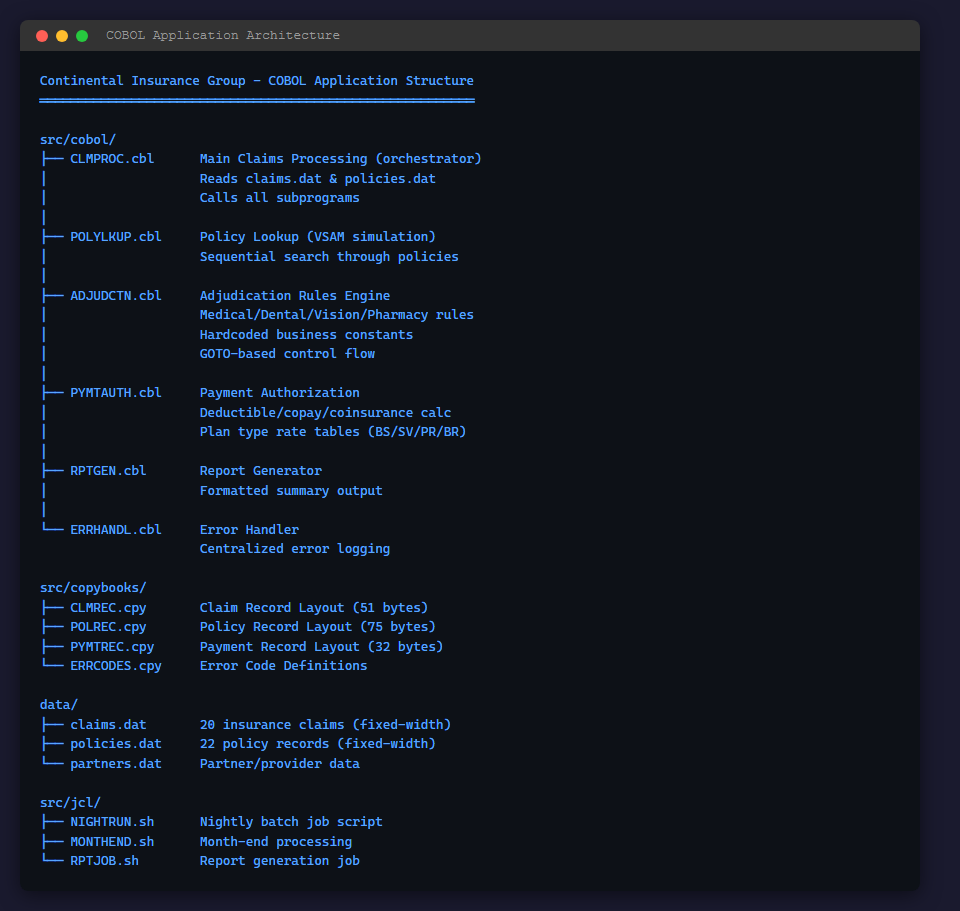
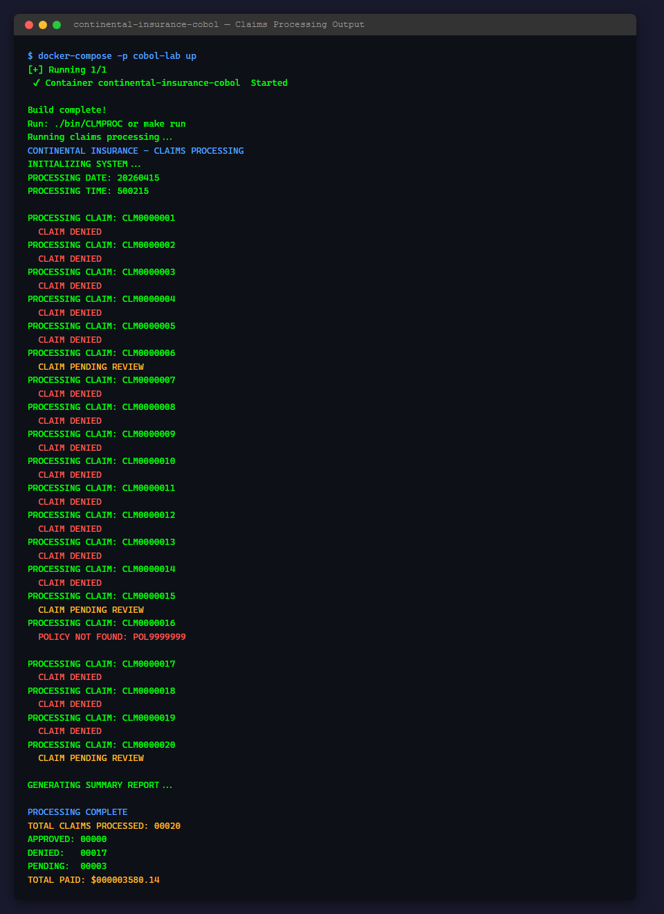
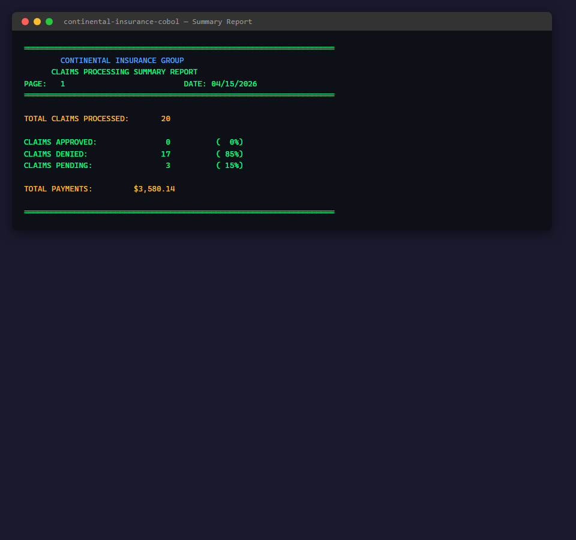

## Legacy Application Overview

Continental Insurance Group's claims processing system is a batch-mode COBOL application built for mainframe environments. It runs inside a GnuCOBOL Docker container (`ubuntu:22.04` + `gnucobol`) and processes insurance claims through a classic orchestrator pattern — the main program (`CLMPROC`) calls subprograms compiled as shared modules, with data layouts defined in COBOL copybooks.

### Application Architecture

The application follows a classic mainframe architecture with a main orchestrator program, subprogram modules for adjudication, policy lookup, payment authorization, report generation, and error handling.



### Claims Processing Pipeline

The main program processes 20 insurance claims from `data/claims.dat`, looking up each against `data/policies.dat`, running adjudication rules, and authorizing payments. All output is terminal-based (no web UI).



### Batch Report Output

After processing, the system generates a formatted summary report showing approval/denial/pending rates and total payment amounts. Current results: 17 denied, 3 pending, 0 approved.



---

## Initial Application Screenshots

The COBOL claims processing system was successfully built and executed inside a GnuCOBOL Docker container (`ubuntu:22.04` + `gnucobol`). This is a batch-mode CLI application — no web UI — so the screenshots below capture terminal output from the running program.

### Claims Processing Output

The main program (`CLMPROC`) processes 20 insurance claims from `data/claims.dat`, looking up each against `data/policies.dat`, running adjudication rules, and authorizing payments.


### Summary Report

After processing, the system generates a formatted summary report showing approval/denial/pending rates and total payment amounts.


### Legacy Code Structure

The application follows a classic mainframe architecture: a main orchestrator program (`CLMPROC`) calls subprograms compiled as shared modules (`.so`), with data layouts defined in COBOL copybooks (`.cpy`).


### Build & Run Notes

- **Docker image**: `continental-insurance/claims-processor:latest` (Ubuntu 22.04 + GnuCOBOL)
- **Compiler flags**: `cobc -std=mf -I./src/copybooks -fixed` (Micro Focus dialect, fixed-format)
- **Runtime**: Batch process — container starts, processes all claims, prints report, exits
- **No exposed ports**: This is a batch job, not a web service
- **Data format**: Fixed-width flat files simulating VSAM indexed datasets
- **Key finding**: All 20 claims processed; 17 denied, 3 pending review, 0 approved — suggests adjudication rules need tuning or test data alignment

---

## GitHub Copilot CLI Walkthrough — COBOL to Java Modernization

This section documents the step-by-step modernization of the legacy COBOL claims processing system to a Java Spring Boot microservice, performed entirely using **GitHub Copilot CLI** (`gh copilot`).

### Prerequisites

- GitHub Copilot CLI installed (`gh copilot --version`)
- Java 8 (Eclipse Temurin JDK 8)
- Apache Maven 3.9.9
- Git

### Setup

```powershell
cd C:\code\gbb\labs\appmodlab-cobol-to-java
git checkout main && git checkout -b solution-final
New-Item -ItemType Directory -Force -Path assets/outputs
```

### Step 1: Explore Legacy COBOL (`step-01-explore-cobol`)

Analyze all COBOL programs, copybooks, JCL scripts, and data files. Produces a comprehensive inventory of the legacy system.

```powershell
gh copilot -- -p "Analyze ALL COBOL source files in src/cobol/, copybook files in src/copybooks/, JCL job scripts in src/jcl/, and data files in data/. Create a comprehensive analysis document at assets/outputs/step-01-cobol-analysis.md covering program inventory, data record layouts, file I/O patterns, subprogram call chains, and batch job orchestration flow." --allow-all-tools --yolo 2>&1 | Tee-Object -FilePath "assets/outputs/step-01.txt"
```

**Output**: `assets/outputs/step-01-cobol-analysis.md` — Program inventory with LOC counts, COBOL-to-subprogram call chain, copybook field mappings, and dependency graph.

### Step 2: Analyze Business Rules (`step-02-analyze-business-rules`)

Extract all hardcoded business rules from the COBOL paragraphs into a structured specification.

```powershell
gh copilot -- -p "Extract ALL business rules from the COBOL programs — adjudication rules (ADJUDCTN.cbl), payment calculation (PYMTAUTH.cbl), orchestration flow (CLMPROC.cbl), error handling (ERRHANDL.cbl). Create assets/outputs/step-02-business-rules.md with thresholds, claim type rules, coinsurance rates, copay tables, and decision trees." --allow-all-tools --yolo 2>&1 | Tee-Object -FilePath "assets/outputs/step-02.txt"
```

**Output**: `assets/outputs/step-02-business-rules.md` — Adjudication rules (min $50, auto-approve ≤$5,000, manual review >$25,000), coinsurance rates (BS=80%, SV=70%, PR=90%, BR=60%), copay tables, coverage calculations.

### Step 3: Generate Modernization Spec (`step-03-modernization-spec`)

Create the specification mapping COBOL constructs to Java equivalents.

```powershell
gh copilot -- -p "Create a modernization specification at assets/outputs/step-03-modernization-spec.md defining: target stack (Java 8, Spring Boot 2.7.x, JPA, H2/Azure SQL, Maven, JUnit 5), COBOL-to-Java class mapping, data model with JPA entities, REST API design, and testing strategy." --allow-all-tools --yolo 2>&1 | Tee-Object -FilePath "assets/outputs/step-03.txt"
```

**Output**: `assets/outputs/step-03-modernization-spec.md` — Complete mapping: CLMPROC→ClaimsProcessingService, ADJUDCTN→AdjudicationService, POLYLKUP→PolicyLookupService, PYMTAUTH→PaymentAuthorizationService, RPTGEN→ReportGenerationService, ERRHANDL→exception classes.

### Step 4: Design Java Architecture (`step-04-java-architecture`)

Scaffold the Spring Boot project with Maven, entities, and enums.

```powershell
gh copilot -- -p "Scaffold the Spring Boot project: pom.xml (Spring Boot 2.7.18, Java 8), application.yml, main class, JPA entity classes (Claim, Policy, Payment with BigDecimal for money), enums (ClaimType, ClaimStatus, PlanType, PaymentStatus). Write architecture doc to assets/outputs/step-04-architecture.md." --allow-all-tools --yolo 2>&1 | Tee-Object -FilePath "assets/outputs/step-04.txt"
```

**Output**: `pom.xml`, 9 Java source files (application class, 3 entities, 4 enums, application.yml), architecture documentation.

### Step 5: Translate Core Logic (`step-05-translate-core-logic`)

Convert COBOL business logic into Java service classes.

```powershell
gh copilot -- -p "Translate COBOL business logic to Java services: ClaimsProcessingService (orchestrator), AdjudicationService (all rules), PolicyLookupService, PaymentAuthorizationService (coinsurance/copay/deductible calculations), ReportGenerationService, and exception classes from ERRHANDL. Use Spring @Service, BigDecimal for money, Java 8 only." --allow-all-tools --yolo 2>&1 | Tee-Object -FilePath "assets/outputs/step-05.txt"
```

**Output**: 5 service classes + 4 exception classes translating all COBOL paragraph logic to Java methods.

### Step 6: Implement Data Access (`step-06-data-access`)

Add repositories, REST controllers, and COBOL data file loader.

```powershell
gh copilot -- -p "Create Spring Data JPA repositories (ClaimRepository, PolicyRepository, PaymentRepository), a DataLoader that parses COBOL fixed-width data files into H2 on startup, and REST controllers (ClaimsController, PolicyController, ReportController) with endpoints for claims processing, policy lookup, and report generation." --allow-all-tools --yolo 2>&1 | Tee-Object -FilePath "assets/outputs/step-06.txt"
```

**Output**: 3 repositories, 3 controllers, 1 DataLoader config class — complete data access layer.

### Step 7: Add Tests (`step-07-add-tests`)

Generate comprehensive JUnit 5 tests for all business logic.

```powershell
gh copilot -- -p "Create JUnit 5 tests: AdjudicationServiceTest (all adjudication rules), PaymentAuthorizationServiceTest (coinsurance/copay/limits), ClaimsProcessingServiceTest (orchestration), ClaimTypeTest, PlanTypeTest (enum fromCode), ClaimsProcessorApplicationTest (context load). Use Mockito for mocking." --allow-all-tools --yolo 2>&1 | Tee-Object -FilePath "assets/outputs/step-07.txt"
```

**Output**: 6 test classes with 60 test methods covering all business rules, payment calculations, and enum mappings.

### Step 8: Build & Validate (`step-08-build-validate`)

Build with Maven and run all tests.

```powershell
$env:JAVA_HOME = "C:\Program Files\Eclipse Adoptium\jdk-8.0.482.8-hotspot"
$env:M2_HOME = "C:\Tools\apache-maven-3.9.9"
$env:PATH = "$env:JAVA_HOME\bin;$env:M2_HOME\bin;$env:PATH"
mvn clean test
```

**Results**:
```
Tests run: 60, Failures: 0, Errors: 0, Skipped: 0
BUILD SUCCESS
```

| Test Class | Tests | Status |
|---|---|---|
| ClaimsProcessorApplicationTest | 1 | ✅ Pass |
| ClaimTypeTest | 7 | ✅ Pass |
| PlanTypeTest | 7 | ✅ Pass |
| AdjudicationServiceTest | 23 | ✅ Pass |
| ClaimsProcessingServiceTest | 5 | ✅ Pass |
| PaymentAuthorizationServiceTest | 17 | ✅ Pass |
| **Total** | **60** | **✅ All Pass** |

### Push

```powershell
git push origin solution-final --tags
```

### COBOL → Java Mapping Summary

| COBOL Program | Java Class | Purpose |
|---|---|---|
| CLMPROC.cbl | ClaimsProcessingService | Orchestrator — processes claims pipeline |
| ADJUDCTN.cbl | AdjudicationService | Rules engine — approve/deny/pending decisions |
| POLYLKUP.cbl | PolicyLookupService + PolicyRepository | Policy lookup via JPA instead of sequential file read |
| PYMTAUTH.cbl | PaymentAuthorizationService | Payment calculation with coinsurance/copay/deductible |
| RPTGEN.cbl | ReportGenerationService | Summary report generation |
| ERRHANDL.cbl | Custom exception classes | Structured error handling via Java exceptions |
| Copybooks (.cpy) | JPA Entity classes | Claim, Policy, Payment with BigDecimal/LocalDate |
| JCL scripts (.sh) | REST API + Spring Boot | Batch jobs → on-demand API endpoints |
| Fixed-width .dat files | H2 database + DataLoader | VSAM simulation → relational database |
